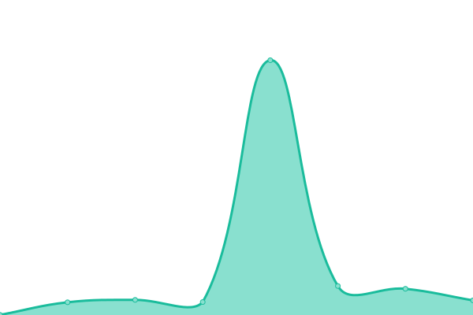

# [📈 Live Status](https://demo.upptime.js.org): <!--live status--> **🟩 All systems operational**

This repository contains the open-source uptime monitor and status page for [Upptime](https://upptime.js.org), powered by [Upptime](https://github.com/upptime/upptime).

With [Upptime](https://upptime.js.org), you can get your own unlimited and free uptime monitor and status page, powered entirely by a GitHub repository. We use [Issues](https://github.com/upptime/upptime/issues) as incident reports, [Actions](https://github.com/abujagonda/statusw/actions) as uptime monitors, and [Pages](https://demo.upptime.js.org) for the status page.

<!--start: status pages-->
<!-- This summary is generated by Upptime (https://github.com/upptime/upptime) -->
<!-- Do not edit this manually, your changes will be overwritten -->
<!-- prettier-ignore -->
| URL | Status | History | Response Time | Uptime |
| --- | ------ | ------- | ------------- | ------ |
|  [One Healthcare ID](https://identity.onehealthcareid.com/app/index.html) | 🟩 Up | [one-healthcare-id.yml](https://github.com/abujagonda/statusw/commits/HEAD/history/one-healthcare-id.yml) | 

 259ms
     
 | 

<a href="https://abujagonda.github.io/statusw/history/one-healthcare-id">100.00%</a>
    

|  [Gov ID](https://identity.optumgovid.com/app/index.html) | 🟩 Up | [gov-id.yml](https://github.com/abujagonda/statusw/commits/HEAD/history/gov-id.yml) | 

 244ms
     
 | 

<a href="https://abujagonda.github.io/statusw/history/gov-id">100.00%</a>
    

|  [Digital Identity](https://engg.identity.uhg.com/realms/demo/.well-known/openid-configuration) | 🟩 Up | [digital-identity.yml](https://github.com/abujagonda/statusw/commits/HEAD/history/digital-identity.yml) | 

 3784ms
     
 | 

<a href="https://abujagonda.github.io/statusw/history/digital-identity">98.28%</a>
    

<!--end: status pages-->

[**Visit our status website →**](https://demo.upptime.js.org)

## 📄 License

- Powered by: [Upptime](https://github.com/upptime/upptime)
- Code: [MIT](./LICENSE) © [Upptime](https://upptime.js.org)
- Data in the `./history` directory: [Open Database License](https://opendatacommons.org/licenses/odbl/1-0/)
